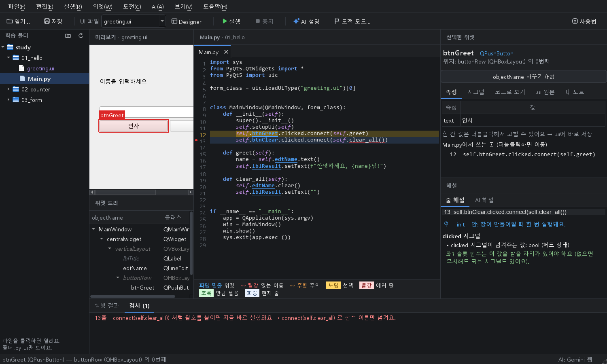

# PyQt 학습 도우미

[](https://github.com/Dawnilove/PyQtStudyHelper/actions/workflows/test.yml)


[](LICENSE)

**Qt Designer로 만든 `.ui`와 직접 짠 `Main.py`를 나란히 놓고, 서로 연결해서 보며 PyQt5를 익히는 학습 도구**입니다.

> `self.btnSave`가 화면의 어느 버튼인지, 이 줄은 왜 이렇게 쓰는지, 에러는 왜 났는지 — PyQt를 처음 배울 때 막히는 곳을 눈으로 보고 바로 고쳐 보면서 풀어 갑니다.

| 밝은 테마 | 어두운 테마 |
|---|---|
|  |  |

## 핵심 기능

- **코드 ↔ 화면 연결**: 코드의 `self.위젯이름`에 마우스를 올리면 미리보기의 그 위젯이 표시되고, 위젯을 클릭하면 그 위젯을 쓰는 코드 줄이 나옵니다. `.ui`는 자동으로 찾아 실시간 미리보기.
- **줄 해설 · 에러 해설**: 줄을 클릭하면 무엇을/왜/주의할 점을 인터넷 없이 설명(170여 가지 규칙). 실행 에러는 쉬운 말로 풀고 그 줄로 이동.
- **실수 미리 잡기**: `.ui`에 없는 이름(오타), `connect(self.함수())`, `setupUi` 빠뜨림, `self.` 누락 등을 실행 전에 밑줄로 경고.
- **코드 대신 넣기**: 위젯 우클릭 → 시그널 연결 코드와 함수 틀 자동 생성, 위젯별 예제 코드, `objectName` 일괄 변경.
- **미리보기에서 `.ui` 편집**: 위젯 추가·삭제·순서 바꾸기, 속성 값 수정 (되돌리기 지원).
- **AI 해설 · 코드 리뷰**: Gemini 무료 티어, Claude Code, 웹 AI, Ollama, 각 API 중 선택.
- **연습**: 저장할 때마다 자동 채점되는 코드 과제 8개, Designer 도전 모드, 학습 기록.
- **편의 기능**: 여러 파일 탭, 자동완성, 찾기·바꾸기, 어두운 테마, 자동 백업·복구, `input()` 지원.

👉 전체 기능 설명: **[docs/FEATURES.md](docs/FEATURES.md)**

## 빠른 시작 (Windows)

### 방법 1: 설치 파일 (처음 쓰는 분께 추천)

1. [Python 3.10 이상](https://www.python.org/downloads/) 설치 — **Add python.exe to PATH** 체크
2. 이 저장소를 내려받아 압축 풀기 (**Code → Download ZIP**)
3. 폴더 안의 **`install.bat`** 더블클릭 → 패키지 설치 + 바탕화면 아이콘 생성
4. 바탕화면의 **PyQt 학습 도우미** 아이콘으로 실행 (또는 `PyQt 학습 도우미 실행.bat`)

> `install.bat` 하나가 아니라 **폴더 전체**가 필요합니다.

### 방법 2: git + 가상환경

```powershell
git clone https://github.com/Dawnilove/PyQtStudyHelper.git
cd PyQtStudyHelper
python -m venv .venv
.venv\Scripts\activate
pip install -r requirements.txt
python run.py
```

파일을 바로 열려면 `python run.py "경로\Main.py"` (`.ui`나 폴더도 가능). 창에 파일을 끌어다 놓아도 열립니다.

## 사용법

1. **Ctrl+O**(또는 왼쪽 탐색기)로 `Main.py`를 엽니다. 맞는 `.ui`가 자동으로 미리보기에 뜹니다.
2. 코드의 **파란 이름**에 마우스를 올려 화면의 위젯을 확인합니다.
3. 궁금한 줄을 클릭하면 해설이 나옵니다. 더 궁금하면 **Ctrl+E**(AI 해설).
4. **F5**로 실행합니다. 에러가 나면 해설과 함께 그 줄로 이동합니다.
5. Designer가 필요하면 **Ctrl+D**. 저장하면 도우미가 바로 반영합니다.

| 단축키 | 기능 | 단축키 | 기능 |
|---|---|---|---|
| F5 | 실행 | Ctrl+E | AI 해설 |
| Ctrl+D | Designer 열기 | F2 | objectName 바꾸기 |
| Ctrl+F / Ctrl+H | 찾기 / 바꾸기 | Tab | 자동완성 |
| Ctrl+B | 탐색기 보이기/숨기기 | Ctrl+Alt+Z | .ui 되돌리기 |
| Ctrl+Shift+T | 코드 과제 | Ctrl+T | 도전 모드 |
| Ctrl+Shift+L | 학습 기록 | Ctrl+, | 설정 |
| F1 | 사용법 | Ctrl+/ | 단축키 전체 목록 |

## AI 해설 켜기

키 없이 **웹 AI 방식**으로 바로 쓸 수 있고, 아래 방법으로 답이 도우미 안에 바로 나오게 바꿀 수 있습니다.

| 방법 | 비용 |
|---|---|
| **무료 AI 켜기** (Gemini 무료 티어) ← 추천 | 무료 (사용량 제한) |
| **Claude Code 구독** (내 PC의 Claude Code) | 내 구독 사용량 |
| **웹 AI** (ChatGPT / Gemini / Claude 웹, 기본값) | 무료 계정 |
| **Ollama** (내 PC) | 완전 무료, 인터넷 불필요 |
| **Claude · GPT · Gemini API** | 유료 |

- API 키는 **Windows 자격 증명 관리자**에만 저장되고 파일·저장소에는 남지 않습니다. 환경변수(`GEMINI_API_KEY` / `OPENAI_API_KEY` / `ANTHROPIC_API_KEY`)가 있으면 우선 사용합니다.
- 설정 방법과 주의 사항: [docs/FEATURES.md#ai-해설-켜기](docs/FEATURES.md#ai-해설-켜기)

## 요구 사항

- Windows 10/11, Python 3.10+
- `PyQt5`, `keyring`, `google-genai`, `openai`, `anthropic`, (선택) `jedi` — [requirements.txt](requirements.txt)
- Designer 연동(Ctrl+D)은 `PyQt5Designer` 패키지의 `designer.exe`를 씁니다 (`install.bat`이 설치 시도).

## 개발

```
run.py          진입점
install.bat     처음 설치 (패키지 + 바탕화면 아이콘)
studyhelper/    프로그램 본체
tests/          자동 테스트
tools/          바탕화면 아이콘 만들기
docs/           기능 설명, 개발 기록, 스크린샷
```

파일별 역할은 [docs/FEATURES.md](docs/FEATURES.md#개발-파일-구조)에 있습니다.

자동 테스트 (GitHub Actions에서도 push마다 실행):

```powershell
$env:QT_QPA_PLATFORM = "offscreen"
python -m unittest discover -s tests -t .
```

## 기여

- 자동완성, 학습 폴더 등록과 Main 파일 모아 보기, 자동 테스트는 **[BlackBuddle](https://github.com/BlackBuddle)** 님이 Pull Request로 추가했습니다.
- 버그 제보와 개선 제안은 [Issues](https://github.com/Dawnilove/PyQtStudyHelper/issues) / Pull Request로 환영합니다.

## 라이선스

[MIT](LICENSE)
