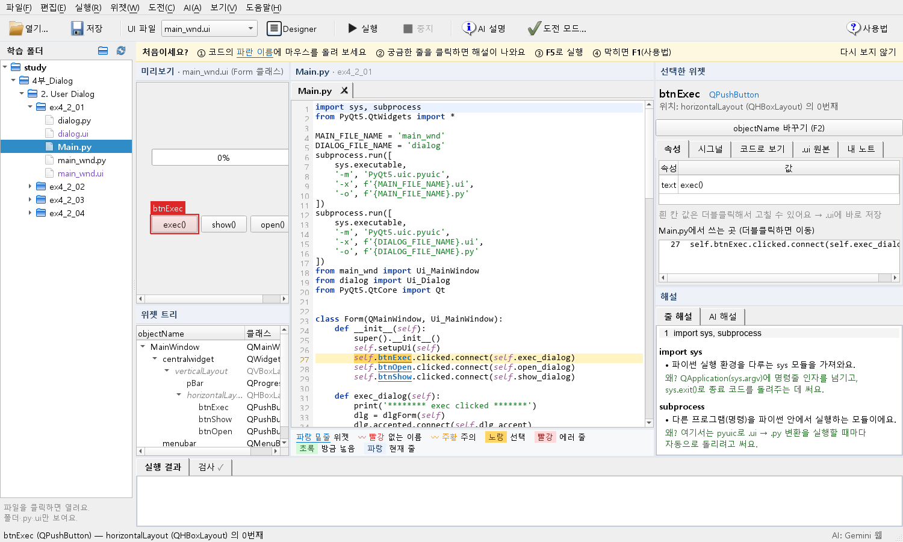

# PyQt 학습 도우미

**Qt Designer로 만든 `.ui`와 직접 짠 `Main.py`를 나란히 놓고, 서로 연결해서 보며 PyQt5를 익히는 학습 도구**입니다.

> `self.btnSave`가 화면의 어느 버튼인지, 이 줄은 왜 이렇게 쓰는지, 에러는 왜 났는지 — PyQt를 처음 배울 때 막히는 곳을 눈으로 보고 바로 고쳐 보면서 풀어 갑니다.



## 이런 걸 해 줍니다

### 코드와 화면을 연결해서 보기
- **실시간 미리보기**: `.ui`를 실제 위젯으로 띄웁니다. Designer에서 저장하면 바로 다시 불러옵니다.
- **마우스를 올리면 연결**: 코드의 파란 `self.위젯이름`에 마우스를 올리면 미리보기의 그 위젯이 빨갛게 표시되고, 클래스·레이아웃 위치·`.ui` 원본 XML이 나옵니다. 미리보기에서 위젯을 클릭하면 그 위젯을 쓰는 코드 줄이 표시됩니다.
- **`.ui` 자동 찾기**: 파이썬 파일을 열면 맞는 `.ui`를 알아서 찾습니다. 한 `Main.py`가 `.ui`를 여러 개 쓰면(`class dlgForm(QDialog, Ui_Dialog)` 등) 커서가 있는 클래스에 맞춰 미리보기가 바뀝니다.

### 설명해 주기
- **줄 해설**: 줄을 클릭하면 **무엇을 하는지 / 왜 이렇게 쓰는지 / 주의할 점**이 나옵니다 (인터넷 없이 동작). 위젯 메서드·시그널, 표·리스트, 타이머·스레드, 레이아웃, 파일 읽기, try/except 같은 수업에 자주 나오는 코드를 170여 가지 규칙으로 설명하고, 규칙에 없는 줄은 AI 해설로 넘길 수 있게 안내합니다.
- **에러 해설**: 실행(F5)이 에러로 끝나면 원인을 쉬운 말로 풀고, 에러 난 줄로 이동해 표시합니다.
- **AI 해설·코드 리뷰**: 선택한 줄 설명(Ctrl+E), 파일 전체 리뷰, 이어서 질문하기. [무료로 켜는 방법](#ai-해설-켜기)이 있습니다. AI 답의 코드 블록은 **코드 복사**로 바로 복사하고, 대화는 **대화 저장**으로 `.md` 파일(내 노트 폴더 등)에 남길 수 있어요.

### 실수를 미리 잡아 주기
- **이름 검사기**: `.ui`에 없는 `self.이름`(오타)은 빨간 물결 밑줄과 비슷한 이름 제안, 없는 슬롯 함수는 주황 밑줄. 문법 오류, pyuic 변환 파일과 import 불일치도 알려 줍니다.
- **초보자 실수 검사**: 실행하기 전에 빨간 밑줄로 알려 줘요.
  - `connect(self.함수())`처럼 괄호를 붙인 연결 (인자가 있으면 `lambda`로 쓰라고 안내)
  - `self.setupUi(self)` 빠뜨림, 또는 `setupUi`보다 먼저 위젯을 쓴 경우
  - `super().__init__()` 빠뜨림
  - `.ui` 위젯 이름 앞에 `self.`를 안 붙인 경우 (`btnOk.clicked` → `self.btnOk.clicked`)
- **`on_위젯_시그널` 함정 경고**: `setupUi`가 이 이름을 자동 연결해서, 직접 `connect`까지 하면 함수가 두 번 실행됩니다.

### 대신 해 주기
- **시그널 연결 코드 넣기**: 시그널 탭에서 시그널을 더블클릭하거나, 미리보기·위젯 트리에서 위젯을 **우클릭**해 자주 쓰는 시그널을 고르면 `connect` 줄과 인자가 맞는 함수 틀을 Main.py에 넣어 줍니다. (Ctrl+Z로 한 번에 되돌리기)
- **위젯별 예제 코드**: 선택한 위젯의 **예제** 탭에 값 읽기·바꾸기, 시그널 연결 같은 자주 쓰는 코드가 이름까지 맞춰 나오고, **복사** 한 번으로 가져갈 수 있어요. Qt 공식 문서 링크도 있어요.
- **`objectName` 바꾸기** (F2): `.ui`의 이름과 모든 참조, Main.py의 `self.이름`을 한꺼번에 바꿔서 짝이 깨지지 않게 합니다.
- **`.ui` 값 고치기**: `text` 같은 단순 속성은 속성 표에서 고치면 `.ui`에 바로 저장됩니다. 도우미가 바꾼 `.ui`는 **편집 → .ui 되돌리기**(Ctrl+Alt+Z)로 바로 전 상태로 돌릴 수 있어요.
- **자동완성** (Tab): `self.` 뒤에 `.ui`의 위젯 이름, `self.위젯.` 뒤에 그 위젯 클래스의 메서드·시그널(`clicked`, `setText` …)이 나옵니다.

### 편하게 쓰기
- **찾기·바꾸기** (Ctrl+F / Ctrl+H): 코드 아래에 막대가 열려요. Enter/Shift+Enter로 다음·이전, 대소문자 구분, 모두 바꾸기(Ctrl+Z 한 번에 되돌림).
- **여러 파일 탭**: 여러 `Main.py`를 탭으로 열어 두고 오갈 수 있어요. 저장 안 한 변경은 탭을 옮겨도 그대로 남고(탭에 ● 표시), 닫을 때 저장할지 물어봐요. 다음에 켜면 **지난번에 열어 둔 탭이 그대로** 열려요.
- **`input()` 지원**: 실행 결과 아래 **입력** 칸에 쓰고 Enter를 누르면, 실행 중인 프로그램의 `input()`으로 들어가요. **지우기**로 결과 창을 비울 수 있어요.
- **어두운 테마**: 보기 메뉴 → 어두운 테마. 코드 색·패널이 모두 바뀌고 기억돼요. (`.ui` 미리보기는 디자인한 모습 그대로 밝게 유지)
- **자동 백업·복구**: 저장 안 한 코드를 20초마다 임시 백업하고, 갑자기 꺼졌다면 다시 열 때 되살릴지 물어봐요.
- **첫 실행 안내**: 처음에는 위에 4단계 안내가 나오고, "다시 보지 않기"로 끌 수 있어요.
- **설정 창** (Ctrl+,): 테마, 글자 크기, 색 범례, 탐색기, 안내 줄, 지난 탭 다시 열기, 새 버전 확인, 자동 백업 간격을 한곳에서 바꿔요.
- **단축키 목록** (Ctrl+/), **오류 기록 보기**(도움말 메뉴): 프로그램이 멈췄을 때의 기록을 버전 정보와 함께 복사해 물어볼 수 있어요.
- **새 버전 알림**: 켤 때 GitHub에 새 버전이 있는지 하루 한 번 확인해서 도움말 메뉴에 알려 줘요 (설정에서 끌 수 있어요).

### 연습하고 정리하기
- **도전 모드** (Ctrl+T): 목표 화면 `.ui`를 보고 Designer로 똑같이 만들면, 저장할 때마다 체크리스트로 자동 채점합니다.
- **왼쪽 탐색기** (VS Code처럼, Ctrl+B로 보이기/숨기기): 학습 폴더를 등록했으면 **폴더 트리**가, 등록하지 않았으면 **최근 파일**이 보입니다. 파일(`.py`·`.ui`)을 클릭하면 바로 열리고, 지금 열린 파일은 강조되며 폴더가 그 위치까지 펼쳐집니다.
- **학습 폴더**: 자주 여는 폴더를 등록하면 탐색기에 폴더 트리가 나오고, 파일 열기 창 왼쪽에 바로가기가 생기고, 시작 화면에 그 안의 `Main.py`가 모여 보입니다.
- **내 노트 연결**: 내 Obsidian 볼트(또는 `.md` 노트 폴더)를 연결하면, 선택한 위젯 클래스가 나오는 노트 섹션을 찾아 줍니다.

## 설치 (Windows)

1. [Python 3.10 이상](https://www.python.org/downloads/) 설치 — 설치 화면에서 **Add python.exe to PATH**를 체크하세요.
2. 이 저장소를 내려받아 압축을 풉니다 (**Code → Download ZIP**).
3. 폴더 안의 **`install.bat`** 을 더블클릭하세요. 필요한 패키지 설치와 바탕화면 아이콘 만들기가 한 번에 끝납니다.
4. 바탕화면의 **PyQt 학습 도우미** 아이콘으로 실행합니다. (또는 `PyQt 학습 도우미 실행.bat`)

> `install.bat` 하나만이 아니라 **폴더 전체**가 필요합니다. 명령줄로 실행하려면 `python run.py "경로/Main.py"` (`.ui`나 폴더도 가능). 창에 파일을 끌어다 놓아도 열립니다.

## 사용법

1. **파일 열기** (Ctrl+O 또는 왼쪽 탐색기에서 클릭): `Main.py`를 엽니다. 맞는 `.ui`가 자동으로 미리보기에 뜹니다.
2. 코드의 **파란 이름**에 마우스를 올려 화면의 위젯을 확인합니다.
3. 궁금한 줄을 클릭하면 오른쪽 아래에 해설이 나옵니다. 더 궁금하면 **Ctrl+E**.
4. **F5**로 실행합니다. 에러가 나면 해설과 함께 그 줄로 이동합니다.
5. Designer가 필요하면 **Ctrl+D**. 저장하면 도우미가 바로 반영합니다.

자세한 사용법은 프로그램 안 **F1(사용법)**, 단축키는 **Ctrl+/**, 색 표시의 뜻은 코드 아래 **색 범례**에 있습니다.

## AI 해설 켜기

처음에는 **웹 AI 방식**으로 바로 쓸 수 있고(키 필요 없음), 아래 방법으로 답이 도우미 안에 바로 나오게 바꿀 수 있습니다.

| 방법 | 비용 | 설정 |
|---|---|---|
| **무료 AI 켜기** (Gemini 무료 티어) ← 추천 | 무료 (사용량 제한) | AI 해설 탭의 파란 **무료 AI 켜기** 버튼 → 구글 AI Studio에서 키를 만들어 **복사 버튼**만 누르면 자동 연결 |
| **Claude Code 구독** (내 PC의 Claude Code) | 내 Claude 유료 구독 사용량 | AI 메뉴 → AI 모델·키 설정에서 선택. 이 PC에 Claude Code(Claude 데스크톱 앱 포함)가 로그인돼 있으면 **API 키 없이** 창 없이 불러와 답이 도우미 안에 나옴 |
| **웹 AI** (ChatGPT / Gemini / Claude 웹) | 무료 계정 | 기본값. Ctrl+E를 누르면 질문이 복사되고 웹 창이 열립니다. 붙여넣고, 답의 복사 버튼을 누르면 답이 도우미로 들어옵니다 |
| **Ollama** (내 PC) | 완전 무료, 인터넷 불필요 | [Ollama](https://ollama.com/download) 설치 후 모델 받기 (PC 성능 필요) |
| **Claude · GPT · Gemini API** | 유료 | AI 메뉴 → AI 모델·키 설정에서 키 입력 |

- API 키는 각자의 **Windows 자격 증명 관리자**에만 저장되고, 파일이나 저장소에는 남지 않습니다. 환경변수(`GEMINI_API_KEY` / `OPENAI_API_KEY` / `ANTHROPIC_API_KEY`)가 있으면 그것을 우선 씁니다.
- Gemini 무료 티어는 분당·하루 사용량 제한이 있고, 무료 티어에서는 입력한 내용이 Google 제품 개선에 쓰일 수 있습니다.
- 웹 AI 방식은 내 코드가 해당 사이트로 보내진다는 점을 알아 두세요. 웹사이트를 자동으로 조작하지 않고, 사용자가 붙여넣고 복사합니다.
- 목록에 없는 새 모델은 모델 칸에 이름을 직접 입력하면 됩니다.

## 요구 사항

- Windows, Python 3.10+
- `PyQt5`, `keyring`, `google-genai`, `openai`, `anthropic`, (선택) `jedi` — `install.bat`이 설치합니다.
- Designer 연동(Ctrl+D)은 `PyQt5Designer` 패키지의 `designer.exe`를 씁니다 (설치 스크립트가 시도).

## 개발

```
run.py                  진입점 (Qt 플러그인 경로 보정, 오류 창)
install.bat             처음 설치 (패키지 + 바탕화면 아이콘)
tools/make_shortcut.py  바탕화면 아이콘 만들기
studyhelper/
  mainwindow.py         화면 조립, 파일 감시, 실행
  preview.py            미리보기 + 위젯 강조
  editor.py             Main.py 편집기 (줄 번호, 하이라이트, hover, 자동완성 팝업)
  completer.py          자동완성 후보 (.ui 위젯, Qt 메서드·시그널, jedi)
  props.py              선택한 위젯 패널
  ui_model.py           .ui XML → 위젯 트리, 값 수정·이름 바꾸기
  locate.py             .py ↔ .ui 찾기, 클래스별 .ui 매핑
  checker.py            이름 검사기
  errors.py             traceback → 쉬운 해설
  explain.py            줄 해설 규칙
  codeview.py           pyuic 생성 코드 해설
  codegen.py, signaldialog.py  시그널 연결 코드 만들기
  renamedialog.py       objectName 바꾸기
  challenge.py          도전 모드
  theme.py              밝은/어두운 테마 색, 화면 스타일 (미리보기는 Designer 모습 그대로)
  icons.py              툴바 아이콘 (그림 파일 없이 직접 그림)
  examples.py           위젯별 예제 코드
  uihistory.py          .ui 되돌리기
  helpmenu.py           단축키 목록, 오류 기록, 새 버전 알림
  settingsdialog.py     설정 창
  findbar.py            찾기·바꾸기 막대
  recovery.py           저장 안 한 코드 임시 백업
  explorer.py           왼쪽 탐색기 (학습 폴더 트리 / 최근 파일)
  studyfolders.py       학습 폴더
  notes.py              내 노트 검색·열기
  ai.py, explainpanel.py, freeai.py   AI 호출, AI 패널, 무료 AI 켜기
tests/                  자동 테스트
docs/                   개발 기록, 스크린샷
```

자동 테스트 실행:

```bash
python -m unittest discover -s tests -t .
```

화면 없이 돌리려면 환경변수 `QT_QPA_PLATFORM=offscreen`을 지정하세요.

## 라이선스

MIT (`LICENSE`).

## 기여

- 자동완성, 학습 폴더 등록과 Main 파일 모아 보기, 자동 테스트는 **[BlackBuddle](https://github.com/BlackBuddle)** 님이 Pull Request로 추가했습니다.
- 버그 제보와 개선 제안은 Issues / Pull Request로 환영합니다.
